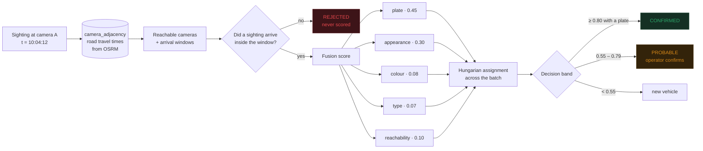
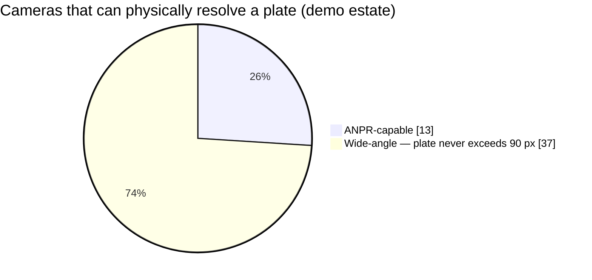
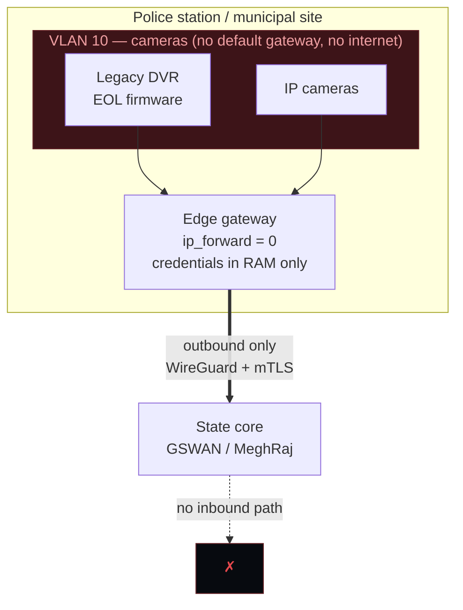
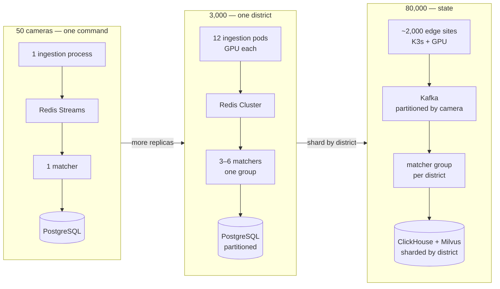

# Architecture Diagrams

Mermaid source, rendered by GitHub and most Markdown viewers.

---

## 1 · System overview

The single most important thing in this diagram is the dashed line: **video
does not cross it**. Only metadata flows edge → core, and only on demand
does a clip flow the other way.

```mermaid
flowchart TB
    subgraph CAM["Heterogeneous estate"]
        C1["IP cameras<br/>RTSP · ONVIF"]
        C2["Analog cameras<br/>on legacy DVRs"]
        C3["Municipal feeds<br/>HLS"]
        C4["Proprietary VMS<br/>vendor SDK"]
    end

    subgraph EDGE["Edge node — one per site"]
        DEC["Decode once<br/>ffmpeg / NVDEC"]
        DET["Detect · YOLOX"]
        TRK["Track · ByteTrack"]
        GATE{"Quality gate<br/>~80% refused"}
        ANPR["ANPR<br/>plate + OCR + lexicon"]
        REID["ReID · 512-d<br/>+ colour + type"]
        BUF[("Local ring buffer<br/>7–30 days video")]
    end

    subgraph CORE["State core"]
        BUS{{"Redis Streams<br/>→ Kafka at scale"}}
        MATCH["Cross-camera matcher<br/>gate → fuse → assign"]
        RULES["Alert engine<br/>configurable rules"]
        DB[("PostgreSQL<br/>PostGIS · pgvector<br/>partitioned")]
        API["API · FastAPI<br/>RBAC · audit"]
        UI["Command centre<br/>React · MapLibre"]
    end

    C1 & C2 & C3 & C4 --> DEC
    DEC --> DET --> TRK --> GATE
    DEC -.no re-encode.-> BUF
    GATE -->|passes| ANPR & REID
    GATE -.->|refused, ~80%| X["discarded"]
    ANPR & REID --> SIGHT["Sighting<br/>~5 kbps per camera"]

    SIGHT ==>|metadata only| BUS
    BUS --> MATCH --> RULES
    MATCH & RULES --> DB
    DB --> API --> UI
    RULES -->|WebSocket| UI
    BUF -.->|clip, on demand only|DB

    style X fill:#3d1418,stroke:#612025,color:#e5484d
    style SIGHT fill:#0d2a35,stroke:#17475a,color:#4cc9f0
    style BUF fill:#141b25,stroke:#33404f
```

---

## 2 · The spatio-temporal gate

Why an 85%-mAP appearance model is unusable against 49 cameras and
trustworthy against 3.

Measured: **1.2 candidate cameras out of 49** in a 3-minute window — 97.6%
(**3.3 of 49** in a 5-minute window — 93.3%)
of comparisons never happen. Appearance alone can never reach CONFIRMED.

---

## 3 · Why ANPR is not enough

74% of the estate is plate-blind. That is not a defect; it is what a
wide-angle junction camera is for. It is also the entire reason
re-identification exists in this design.

---

## 4 · Security zones for legacy DVRs

No inbound rules at any site. A compromised core cannot pivot into a camera
VLAN, because the gateway does not forward.

---

## 5 · Scaling shape

The application code is identical across all three. Only replica counts,
backing stores and placement change — see [SCALING.md](SCALING.md).
